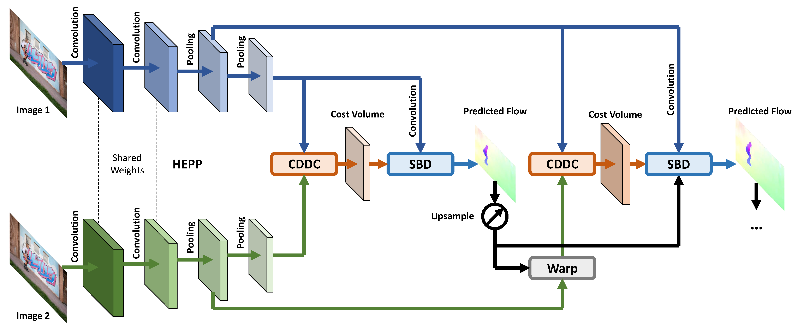

# FastFlowNet: A Lightweight Network for Fast Optical Flow Estimation
The official PyTorch implementation of [FastFlowNet](https://arxiv.org/abs/2103.04524) (ICRA 2021).

Authors: [Lingtong Kong](https://scholar.google.com.hk/citations?user=KKzKc_8AAAAJ&hl=zh-CN), [Chunhua Shen](https://cshen.github.io/), [Jie Yang](http://www.pami.sjtu.edu.cn/jieyang)

## Network Architecture
Dense optical flow estimation plays a key role in many robotic vision tasks. It has been predicted with satisfying accuracy than traditional methods with advent of deep learning. However, current networks often occupy large number of parameters and require heavy computation costs. These drawbacks have hindered applications on power- or memory-constrained mobile devices. To deal with these challenges, in this paper, we dive into designing efficient structure for fast and accurate optical flow prediction. Our proposed FastFlowNet works in the well-known coarse-to-fine manner with following innovations. First, a new head enhanced pooling pyramid (HEPP) feature extractor is employed to intensify high-resolution pyramid feature while reducing parameters. Second, we introduce a novel center dense dilated correlation (CDDC) layer for constructing compact cost volume that can keep large search radius with reduced computation burden. Third, an efficient shuffle block decoder (SBD) is implanted into each pyramid level to acclerate flow estimation with marginal drops in accuracy. The overall architecture of FastFlowNet is shown as below.

## NVIDIA Jetson TX2
Optimized by [TensorRT](https://developer.nvidia.com/tensorrt), proposed FastFlowNet can approximate real-time inference on the Jetson TX2 development board, which represents the first real-time solution for accurate optical flow on embedded devices. For training, please refer to [PWC-Net](https://github.com/NVlabs/PWC-Net) and [IRR-PWC](https://github.com/visinf/irr), since we use the same datasets, augmentation methods and loss functions. A demo video for real-time inference on embedded device is shown below, note that there is time delay between real motion and visualized optical flow. [YouTube Video Presentation](https://www.youtube.com/watch?v=dSkI4YisL9o).

## Optical Flow Performance
Experiments on both synthetic [Sintel](http://sintel.is.tue.mpg.de/) and real-world [KITTI](http://www.cvlibs.net/datasets/kitti/) datasets demonstrate the effectiveness of proposed approaches, which consumes only 1/10 computation of comparable networks ([PWC-Net](https://github.com/NVlabs/PWC-Net) and [LiteFlowNet](https://github.com/twhui/LiteFlowNet)) to get 90\% of their performance. In particular, FastFlowNet only contains 1.37 M parameters and runs at 90 or 5.7 fps with one desktop NVIDIA GTX 1080 Ti or embedded Jetson TX2 GPU on Sintel resolution images. Comprehensive comparisons among well-known flow architectures are listed in the following table. Times and [FLOPs](https://github.com/gengshan-y/VCN) are measured on Sintel resolution images with PyTorch implementations.

|             | Sintel Clean Test (AEPE) | KITTI 2015 Test (Fl-all) | Params (M) | FLOPs (G) | Time (ms) 1080Ti | Time (ms) TX2 |
|:-----------:|:------------------------:|:------------------------:|:----------:|:---------:|:----------------:|:-------------:|
|   FlowNet2  |           4.16           |          11.48%          |   162.52   |  24836.4  |        116       |      1547     |
|    SPyNet   |           6.64           |          35.07%          |    1.20    |   149.8   |        50        |      918      |
|   PWC-Net   |           4.39           |           9.60%          |    8.75    |    90.8   |        34        |      485      |
| LiteFlowNet |           4.54           |           9.38%          |    5.37    |   163.5   |        55        |      907      |
| FastFlowNet |           4.89           |          11.22%          |    1.37    |    12.2   |        11        |      176      |

Some visual examples of our FastFlowNet on several image sequences are presented as follows.

  
  
    
  
  
    
  
  
  

## Usage
Our original experiment environment is with CUDA 9.0, Python 3.6 and PyTorch 0.4.1. First, you should build and install the Correlation module in <code>./models/correlation_package/</code> with command below
<pre><code>$ python setup.py build</code>
<code>$ python setup.py install</code></pre>

## Higher CUDA and PyTorch versions Support
<code>./models/FastFlowNet_v1.py</code> is the equivalent version of <code>./models/FastFlowNet.py</code> that supports CUDA 10.x and PyTorch 1.2.0/1.3.0. For using <code>./models/FastFlowNet_v1.py</code>, you should run <code>pip install spatial-correlation-sampler==0.2.0</code>.

<code>./models/FastFlowNet_v2.py</code> is the equivalent version of <code>./models/FastFlowNet.py</code> that supports CUDA 10.x/11.x and PyTorch 1.6.x/1.7.x/1.8.x/1.9.x/1.10.x/1.11.x/1.12.x. For using <code>./models/FastFlowNet_v2.py</code>, you should run <code>pip install spatial-correlation-sampler==0.4.0</code>.

To benchmark running speed and calculate model parameters, you can run
<pre><code>$ python benchmark.py</code></pre>

A demo for predicting optical flow given two time adjacent images, please run
<pre><code>$ python demo.py</code></pre>
Note that you can change the pre-trained models from different datasets for specific applications. The model <code>./checkpoints/fastflownet_ft_mix.pth</code> is fine-tuned on mixed Sintel and KITTI, which may obtain better generalization ability.

## Support TensorRT

Support TensorRT with below configuration:

card: nvidia RTX3060Ti\
driver: 470.103.01\
cuda: 11.3\
tensorrt: 8.0.1GA\
pytorch: 1.10.2+cu113

To inference on tensorrt: 

First clone tensorrt oss and copy <code><Proj_ROOT>/tensorrt_workspace/TensorRT</code> to tensorrt oss and build:
<pre><code>$ cp -rf ./tensorrt_workspace/TensorRT/* ${TensoRT_OSS_ROOT}/ </code>
<code>$ cd ${TensoRT_OSS_ROOT} && mkdir build && cd build</code>
<code>$ cmake .. -DTRT_LIB_DIR=$TRT_LIBPATH -DTRT_OUT_DIR=`pwd`/out -DCUDA_VERSION=11.3</code>
<code>$ make -j</code></pre>

Second build correlation module for pytorch:
<pre><code>$ cd ./tensorrt_workspace/correlation_pytorch/</code>
<code>$ python setup.py build</code></pre>

Then copy the root of tensorrt plugin library libnvinfer_plugin.so into <code>./tensorrt_workspace/tensorrt_plugin_path</code> and run <code>python ./tensorrt_workspace/fastflownet.py</code> to build engine, run <code>python ./tensorrt_workspace/infr.py</code> to inference with tensorrt.

With fp16, FastFlowNet can run at 220FPS with input size of 512x512, and results:

### TensorRT Docker Environment
To facilitate the actual deployment of FastFlowNet with TensorRT, here is a Docker TensorRT environment: [https://hub.docker.com/r/pullmyleg/tensorrt8_cuda11.3_pytorch1.10.2_fastflownet](https://hub.docker.com/r/pullmyleg/tensorrt8_cuda11.3_pytorch1.10.2_fastflownet).

### Unsupervised Pre-trained FastFlowNet on Chairs, GTAV, Sintel and KITTI
[MDFlow: Unsupervised Optical Flow Learning by Reliable Mutual Knowledge Distillation](https://github.com/ltkong218/MDFlow)

## Citation
When using any parts of the Software or the Paper in your work, please cite the following paper:
<pre><code>@InProceedings{Kong_2021_ICRA, 
  author={Kong, Lingtong and Shen, Chunhua and Yang, Jie}, 
  title={FastFlowNet: A Lightweight Network for Fast Optical Flow Estimation}, 
  booktitle={2021 IEEE International Conference on Robotics and Automation (ICRA)}, 
  year={2021}
}</code></pre>
